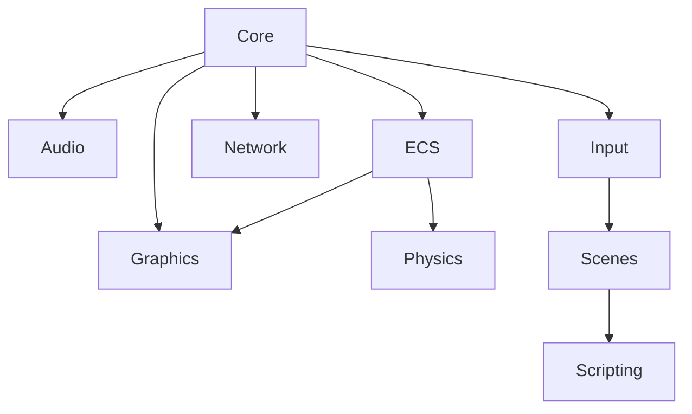

# Architecture Documentation - Game Engine Modules

## Core Modules

### 1. `Core` - Engine Foundation
- **Application**
  - Manages application lifecycle: `init()`, `run()`, `shutdown()`
  - Handles main loop execution
- **Timer**
  - Tracks `deltaTime` between frames
  - Manages frame rate limiting (FPS control)
- **Logger**
  - Multi-level logging: `info`, `warning`, `error`, `debug`
  - Optional file/output redirection
- **Config**
  - JSON/INI configuration file parsing
  - Settings management with default fallbacks
- **Events**
  - Centralized event bus system
  - Input events, system events, custom events

### 2. `Graphics` - Rendering System
- **Renderer**
  - SDL_Renderer wrapper with extensions
  - Batch rendering support
- **TextureManager**
  - Resource caching (texture atlas support)
  - Automatic memory management
  - Supports: PNG, JPG, BMP via SDL_image
- **Camera2D**
  - Viewport management
  - Parallax scrolling
  - Screen-to-world coordinate conversion
- **Sprite**
  - 2D sprite rendering with transformations
  - Animation system (frame-based/spritesheet)
- **FontRenderer**
  - TrueType font support via SDL_ttf
  - Text formatting and caching

### 3. `Audio` - Sound System
- **SoundManager**
  - SFX playback with channel management
  - Volume/panning control
- **MusicManager**
  - Streaming music playback
  - Crossfade transitions between tracks
  - Playlist support

### 4. `Input` - Input Handling
- **InputManager**
  - Unified input handling for:
    - Keyboard (scancode/keycode)
    - Mouse (position, buttons, wheel)
    - Game controllers (SDL_GameController)
- **Bindings**
  - Input mapping configuration
  - Action-based input system
  - Device-agnostic bindings

### 5. `Network` - Multiplayer
- **NetClient/NetServer**
  - TCP/UDP networking via SDL_net
  - Connection management
- **PacketManager**
  - Binary packet serialization
  - State synchronization
  - Protocol versioning

### 6. `ECS` - Entity Component System
- **Entity**
  - Unique numeric ID (UUID optional)
  - Tagging system
- **Component**
  - Data-only structures:
    - `Position`, `Velocity`
    - `Sprite`, `Collider`
    - Custom components
- **System**
  - Logic processors:
    - `PhysicsSystem`
    - `RenderSystem`
    - Custom systems
- **Coordinator**
  - Entity-component registry
  - System scheduling

### 7. `Physics` - 2D Physics
- **RigidBody2D**
  - Physics properties:
    - Mass, velocity
    - Friction, restitution
    - Gravity scale
- **Collider2D**
  - Collision shapes:
    - AABB (axis-aligned)
    - Circles
    - Convex polygons
- **CollisionSystem**
  - Broad/narrow phase detection
  - Collision resolution
  - Callback system
- **PhysicsSystem**
  - Numerical integration
  - Force application

### 8. `Scenes` - Game State Management
- **Scene** (Abstract Base Class)
  - Interface methods:
    - `load()`, `unload()`
    - `update()`, `render()`
    - `handleEvents()`
- **SceneManager**
  - Scene stacking system
  - Transition effects:
    - Fade, slide, etc.
  - Pause/resume functionality

### 9. `Scripting` - Game Logic
- **Lua Integration**
  - Powered by sol2 wrapper
  - Features:
    - Entity manipulation
    - Event binding
    - Custom API exposure
  - Hot-reloading support

## Cross-Module Dependencies

